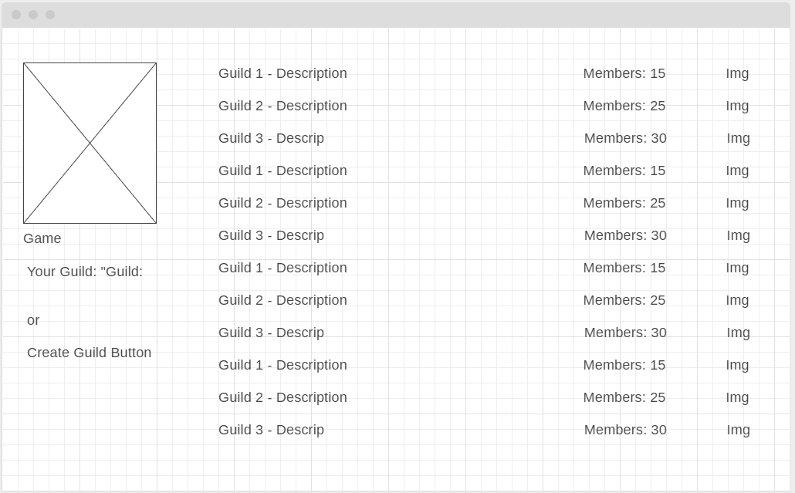
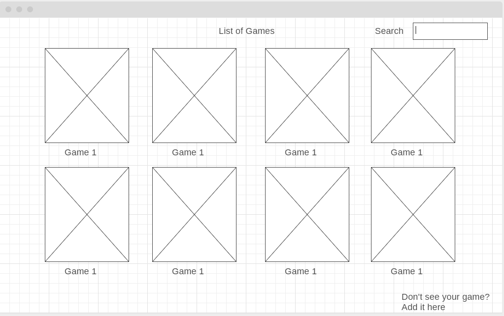
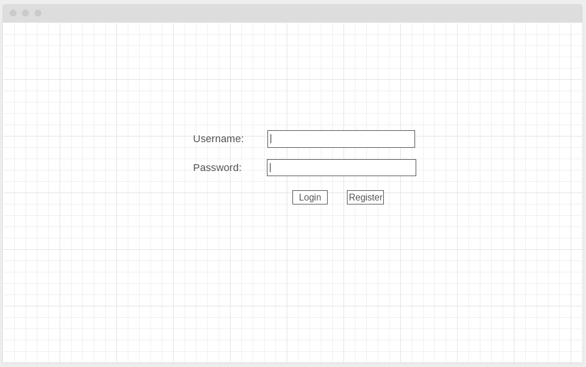
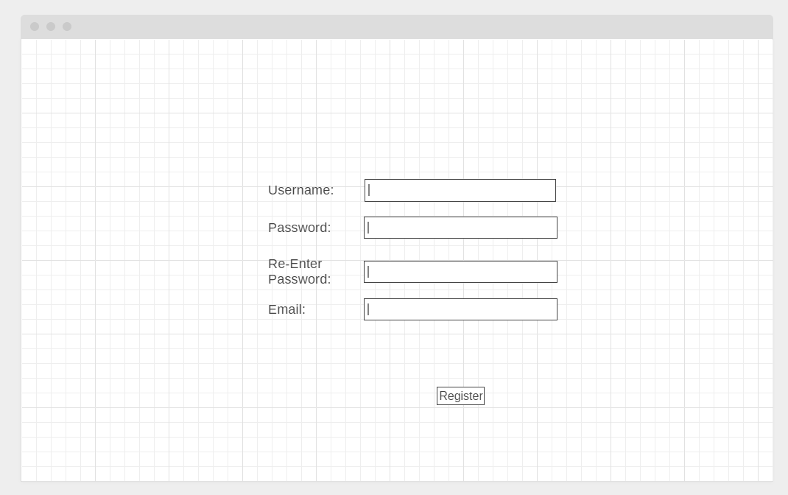
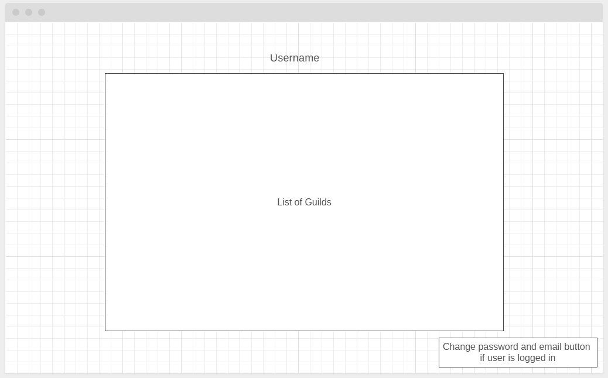
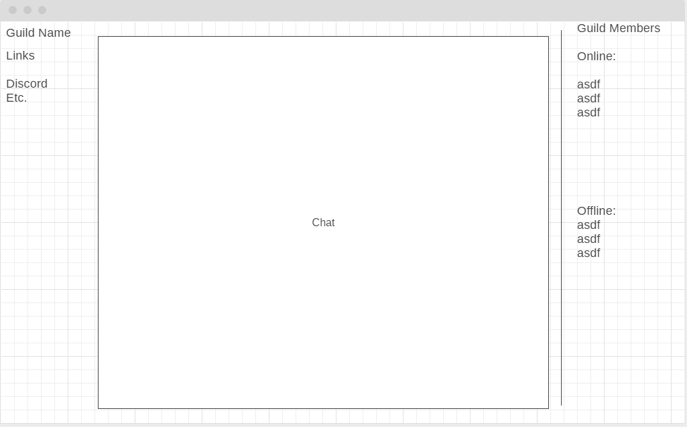
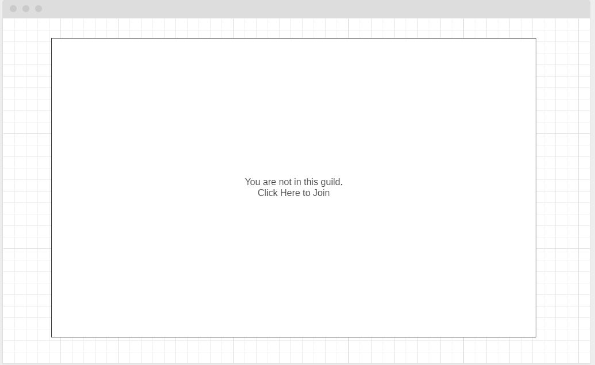
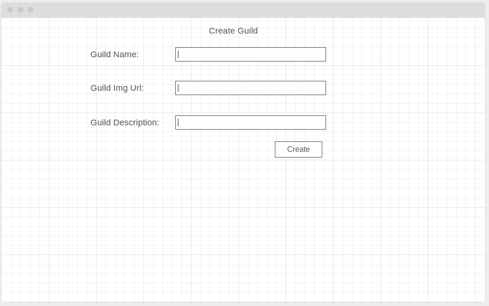
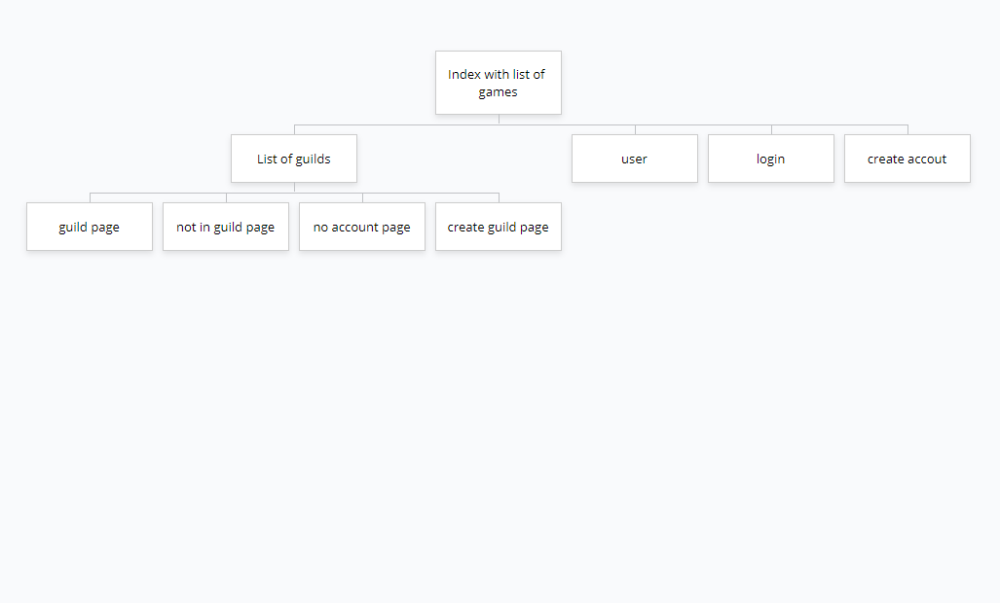

# Guilds

## Overview

  Tired of not having anyone to play your favorite game with? Well, that's where Guilds comes in!
Guilds is a platform for gamers to create their own communities for their favorite games much like an actual guild in a game such as WoW.
Many games, such as Hearthstone, Genshin Impact, Fortnite, Among Us don't really have a system in place for players to build up a group of friends
to consistently play together and do cool stuff.
With Guilds, users can create their own accounts and keep track of the guilds that they are in for different games. Users can also create guilds of their
own for others to join. The idea is to have a list of games that users can create guilds for, and as more users join the site, they would be able to add
games that are not on the list to create a guild for. Initial goal is to implement at least a chat room for each guild group.


## Data Model

The application will store Users, Guilds, and Games, and Chat

* users can be in multiple guilds
* one guild can have multiple users
* each guild can only revolve around 1 game
* a user can create multiple guilds of different games
* a user can only create 1 guild per game
* a guild can only have many chat rooms
* a chat room can only belong to one guild

An Example User:

```javascript
{
  username: "gamerdude123",
  hash: // a password hash,
  status: //is the user online or not
  guilds: // an array of guild objects that the user is in and the date they joined
  ownGuilds: //an array of guilds that the user created
}
```

An Example Guild:

```javascript
{
  guildName: "WoW Raiders",
  game: "Wow",
  state: "private",
  description: "We raiding all day",
  imgUrl: img.png,
  memberLimit: 50,
  members: [
    { name: "player1", joinDate: //timestamp},
    { name: "player2", joinDate: //timestamp},
  ],
  chatRooms: //array of chatrooms that belong to the guild
  createdAt: // timestamp
}
```

An Example Game:

```javascript
{
  game: "WoW",
  guilds: //array of guilds that are related to WoW
}
```

An Example Chat Room:

```javascript
{
  name: //chatroom name
  messages: //array of objects that contains user messages and timestamp
}
```

## [Link to Commented First Draft Schema](https://github.com/nyu-csci-ua-0480-034-fall-2020/Flydx1234-final-project/blob/master/db.js)

## Wireframes

/guilds - page that lists guilds



/index - page showing all games




/login - page for user to login



/register - page for user to register



/user - page that lists the user's guilds and allows them to change password/email if logged in


/inguild - page shown if user is in the guild



/notinguild - page shown if user is not in the guild



/createGuild - page shown when creating a guild



## Site map



## User Stories or Use Cases

1. as non-registered user, I can register a new account with the site
2. as non-registered user, I can see the list of games and Guilds
3. as non-registered user, I can see other user's profiles
4. as a user, I can log in to the site
5. as a user, I can create or join a guild
6. as a user, I can add a game to the overall list of games
7. as a guild member, I can see the guild members and chat in the chatroom

## Research Topics

* (5 points) Integrate user authentication
    * I'm going to be using passport for user authentication.
    * Passport allows for authentication through a username/password, twitter, facebook, google, etc.
    * This gives the user more options to log in, and verify their identity.
* (3 points) Deploying my site through Heroku
    * Heroku is a cloud application platform.
    * Allows users to deploy and manage web apps, and has a free tier.
    * I am using this because I would like my site to be deployed outside of the courant system.
* (1 point) Integrating ReCaptcha
    * ReCaptcha is a turing test to differentiate robots from humans.
    * This helps prevent spam and bots from abusing the site.


9 points total out of 8 required points (___TODO__: addtional points will __not__ count for extra credit_)


## [Link to Initial Main Project File](app.js)

## Annotations / References Used

1. [ReCaptcha Docs](https://developers.google.com/recaptcha/docs/display) - (https://github.com/nyu-csci-ua-0480-034-fall-2020/Flydx1234-final-project/blob/3a34c4f22943c4aa23f93582bf84541a818d865c/views/register.hbs#L6)
2. [Heroku Node.js Setup](https://devcenter.heroku.com/articles/getting-started-with-nodejs) - (https://github.com/nyu-csci-ua-0480-034-fall-2020/Flydx1234-final-project/blob/3a34c4f22943c4aa23f93582bf84541a818d865c/Procfile#L1)
